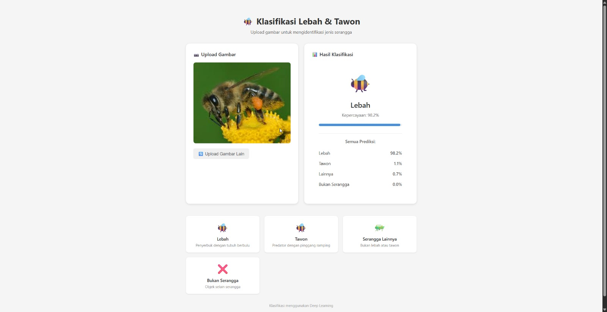

# 🐝 Klasifikasi Lebah & Tawon



Aplikasi web untuk mengklasifikasi gambar serangga menggunakan Deep Learning. Sistem dapat mengidentifikasi apakah gambar yang diupload merupakan Lebah, Tawon, Serangga Lainnya, atau Bukan Serangga.

## 📋 Deskripsi

Proyek ini menggunakan model MobileNetV2 yang telah di-fine-tune untuk mengklasifikasi 4 kategori:

| Kelas | Deskripsi |
|-------|-----------|
| **Lebah** | Serangga penyerbuk dengan tubuh berbulu |
| **Tawon** | Serangga predator dengan pinggang ramping |
| **Lainnya** | Serangga selain lebah dan tawon |
| **Bukan_Serangga** | Objek yang bukan serangga |

## 🛠️ Teknologi

### Backend
- Python 3.x
- FastAPI
- TensorFlow / Keras
- MobileNetV2 (Transfer Learning)

### Frontend
- Vue.js 3
- TypeScript
- Vite

## 📁 Struktur Proyek

```
beeorwaspAI/
├── backend/
│   └── main.py          # API server FastAPI
├── frontend/
│   ├── src/
│   │   ├── App.vue      # Komponen utama
│   │   ├── main.ts      # Entry point
│   │   └── style.css    # Styling
│   ├── index.html
│   └── package.json
├── model/
│   ├── model_serangga.keras   # Model terlatih
│   └── class_indices.json     # Mapping kelas
└── README.md
```

## 🚀 Cara Menjalankan

### 1. Setup Backend

```bash
# Masuk ke folder backend
cd backend

# Install dependencies
pip install fastapi uvicorn tensorflow pillow python-multipart

# Jalankan server
python main.py
```

Server akan berjalan di `http://localhost:8000`

### 2. Setup Frontend

```bash
# Masuk ke folder frontend
cd frontend

# Install dependencies
npm install

# Jalankan development server
npm run dev
```

Frontend akan berjalan di `http://localhost:5173`

## 📡 API Endpoints

| Method | Endpoint | Deskripsi |
|--------|----------|-----------|
| GET | `/` | Health check |
| GET | `/api/health` | Status model |
| POST | `/api/predict` | Klasifikasi gambar |

### Contoh Request

```bash
curl -X POST "http://localhost:8000/api/predict" \
  -H "Content-Type: multipart/form-data" \
  -F "file=@gambar.jpg"
```

### Contoh Response

```json
{
  "class_name": "Lebah",
  "confidence": 0.95,
  "all_predictions": [
    {"class_name": "Lebah", "confidence": 0.95},
    {"class_name": "Tawon", "confidence": 0.03},
    {"class_name": "Lainnya", "confidence": 0.01},
    {"class_name": "Bukan_Serangga", "confidence": 0.01}
  ]
}
```

## 🖼️ Cara Penggunaan

1. Buka aplikasi di browser (`http://localhost:5173`)
2. Upload gambar dengan cara:
   - Drag & drop gambar ke area upload, atau
   - Klik area upload untuk memilih file
3. Tunggu proses klasifikasi
4. Lihat hasil prediksi beserta tingkat kepercayaan

## 📝 Catatan

- Pastikan backend sudah berjalan sebelum menggunakan frontend
- Format gambar yang didukung: JPG, PNG, WEBP
- Ukuran gambar akan di-resize ke 224x224 pixel untuk prediksi

## 👤 Author

Dibuat untuk keperluan tugas/proyek klasifikasi gambar serangga.
